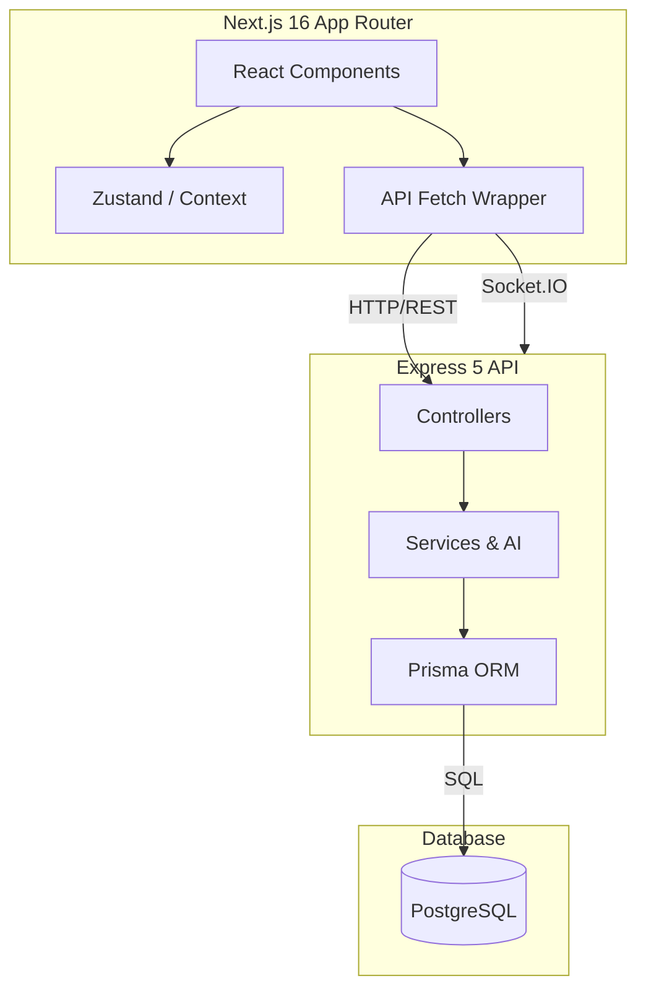
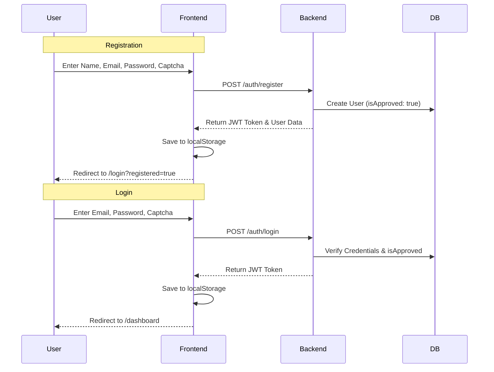
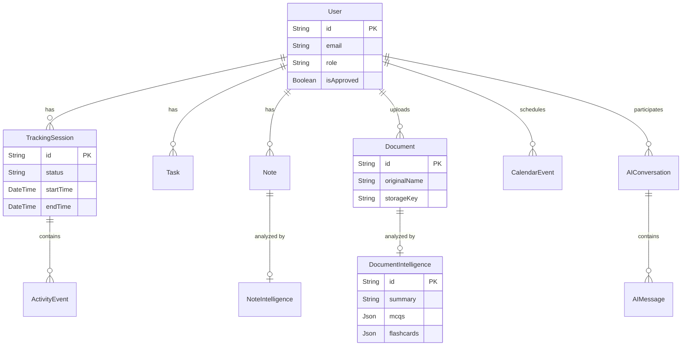

# StudyTrack — AI Developer Learning OS

> Deep work tracker, AI tutor, curriculum planner, and productivity analytics platform.  
> Built with Next.js 16 (App Router) + Express 5 + PostgreSQL (Prisma) + Gemini AI.

---

## Architecture Overview



**Real‑time:** Socket.IO for live telemetry (browser extension → backend → dashboard widget).  
**Auth:** JWT‑based (custom, no Clerk). Two‑factor via captcha (no OTP).  
**AI:** Google Gemini Flash (`gemini‑flash‑latest`) for summaries, quizzes, chat, insights.  
**AI Agent (RAG):** Project‑aware chatbot with automatic codebase indexing — scans all source files on startup, retrieves relevant code at query time for accurate answers.

---

## Quick Start

```bash
# Backend
cd backend
cp .env.example .env          # fill in DATABASE_URL, GEMINI_API_KEY, SMTP_*
npx prisma generate
npx prisma db push
npm run dev                    # → http://localhost:5000

# Frontend
cd frontend
cp .env.example .env.local
npm run dev                    # → http://localhost:3000
```

**Default dev accounts** (auto‑created on first login):
| Email | Password | Role |
|-------|----------|------|
| `user@studytrack.dev` | `password123` | STUDENT |
| `admin@studytrack.dev` | `password123` | ADMIN |

---

## Project Structure

```
D:\Cognarc it\
├── backend/
│   ├── prisma/schema.prisma      # 25 models, 16 enums
│   ├── src/
│   │   ├── server.ts             # Express 5 entry point + Socket.IO
│   │   ├── data/
│   │   │   └── project-context.ts # Comprehensive project summary (system prompt)
│   │   ├── middleware/
│   │   │   ├── auth.ts           # JWT authenticate + optionalAuth
│   │   │   └── upload.ts         # Multer 50MB, whitelist MIME types
│   │   ├── routes/               # 17 route files
│   │   ├── controllers/          # 16 controllers
│   │   └── services/
│   │       ├── gemini.service.ts # Gemini API wrapper (chat, upload, intelligence)
│   │       ├── ai.service.ts     # AI orchestration (summary, quiz, chat, project Q&A)
│   │       └── project-indexer.service.ts  # RAG: scans & indexes all source files
│   └── uploads/                  # local file storage
│
├── frontend/
│   ├── src/
│   │   ├── app/
│   │   │   ├── (auth)/           # login, forgot‑password, reset‑password
│   │   │   ├── (dashboard)/      # 20 protected pages
│   │   │   ├── register/         # registration page
│   │   │   ├── layout.tsx        # root layout (AuthProvider, Providers)
│   │   │   └── page.tsx          # landing page
│   │   ├── components/
│   │   │   ├── ui/               # Card, Button, Input, Badge, Sidebar, Modal
│   │   │   ├── dashboard/
│   │   │   │   ├── LiveActivityWidget.tsx
│   │   │   │   ├── ChatBotWidget.tsx  # Floating chatbot (RAG-powered, project-aware)
│   │   │   │   └── ...
│   │   │   └── calendar/         # custom calendar components
│   │   ├── lib/
│   │   │   ├── api.ts            # ApiClient singleton (fetch wrapper)
│   │   │   ├── auth-context.tsx  # AuthProvider, useAuth hook
│   │   │   └── useActivityTracker.ts  # activity event batching
│   │   └── store/
│   │       └── sidebarStore.ts   # zustand store for sidebar state
│   └── public/
│
├── extension/
│   ├── browser/                  # Chrome MV3 extension (tab tracking)
│   └── desktop/                  # Node.js desktop agent (active‑win)
│
├── database/
│   ├── schema.sql                # full SQL schema
│   └── seed.sql                  # sample data
│
└── docs/
    ├── architecture.md
    └── spec-ultimate-prompt.txt
```

---

## Auth Flow



- **Captcha**: 6 chars from `abcdefghjkmnpqrstuvwxyz@#$!*+=`, 15‑s auto‑refresh, lowercased client‑side before verification.
- **JWT**: Signed with `JWT_SECRET`, stored in `localStorage`, sent as `Authorization: Bearer <token>`. Expired/invalid tokens → 401 → redirect to `/login`.
- **Rate limit**: 30 requests / 15 min on `/api/auth`.
- **Admin approval**: New users auto‑approved (`isApproved: true` on register). Login checks `isApproved` and auto‑approves after 24h if not already approved.

---

## API Routes (all under `/api`)

| Group | Auth | Endpoints |
|-------|------|-----------|
| **Auth** | No (except /me, /settings, /logout) | `GET /captcha`, `POST /register`, `POST /login`, `POST /forgot‑password`, `POST /reset‑password`, `GET /me`, `PUT /profile`, `PUT /password`, `PUT /settings`, `GET /settings`, `POST /logout` |
| **Users** | Yes | `GET /`, `GET /stats`, `GET /pending`, `GET /admin/stats`, `GET /:id`, `POST /:id/approve`, `POST /:id/reject`, `DELETE /:id` |
| **Tracking** | Yes | `POST /sessions/start`, `POST /sessions/:id/pause`, `POST /sessions/:id/resume`, `POST /sessions/:id/stop`, `POST /sessions/:id/activities`, `POST /sessions/batch‑activities`, `GET /sessions/dashboard`, `GET /sessions/live`, `GET /sessions/current`, `GET /sessions`, `GET /sessions/:id/stats`, `GET /sessions/:id/activities`, `GET /sessions/:id/pdf` |
| **Tasks** | Yes | `GET /`, `GET /stats`, `GET /:id`, `POST /`, `PUT /:id`, `DELETE /:id` |
| **Notes** | Yes | `GET /`, `GET /:id`, `POST /`, `PUT /:id`, `DELETE /:id`, `PATCH /:id/pin` |
| **Calendar** | Yes | `GET /`, `POST /`, `GET /search/query`, `GET /stats/overview`, `GET /:eventId`, `PUT /:eventId`, `DELETE /:eventId` |
| **AI** | Yes | `POST /summary`, `POST /quiz`, `POST /chat`, `POST /query‑project`, `GET /conversations`, `GET /conversations/:id`, `DELETE /conversations/:id` |
| **Reports** | Yes | `GET /`, `GET /daily‑ai‑summary`, `POST /daily‑ai‑summary/trigger`, `POST /sessions/:id/generate`, `POST /periodic`, `GET /:reportId`, `GET /:reportId/pdf` |
| **Analytics** | Yes | `GET /dashboard`, `GET /weekly‑trends`, `GET /category‑breakdown`, `GET /productivity‑trend` |
| **Telemetry** | Yes | `POST /browser`, `POST /desktop`, `GET /stats` |
| **Upload** | Yes | `POST /`, `GET /my‑files`, `GET /:id`, `PATCH /:id/metadata`, `DELETE /:id` |
| **Sessions** | Yes | `GET /`, `GET /today`, `GET /:id`, `POST /`, `PUT /:id`, `DELETE /:id` |
| **Resources** | Yes | `GET /`, `GET /:id`, `POST /`, `PUT /:id`, `DELETE /:id` |
| **Insights** | Yes | `GET /productivity`, `GET /roadmap`, `GET /interview‑questions` |
| **Export** | Yes | `GET /` |
| **Webhooks** | No (raw body) | `POST /clerk` (Clerk Svix webhook) |
| **Health** | No | `GET /health` |

---

## Frontend Pages

### Public
| Route | File | Description |
|-------|------|-------------|
| `/` | `app/page.tsx` | Landing page (hero, features, curriculum, CTA) |
| `/login` | `app/(auth)/login/page.tsx` | Login with captcha, test‑user quick‑fill buttons |
| `/register` | `app/register/page.tsx` | Registration (role selector: Learner/Mentor) |
| `/forgot‑password` | `app/(auth)/forgot-password/page.tsx` | Email + captcha → reset link |
| `/reset‑password` | `app/(auth)/reset-password/page.tsx` | Token + email + new password |

### Authenticated (all under `(dashboard)` route group)
| Route | File | Description |
|-------|------|-------------|
| `/dashboard` | `dashboard/page.tsx` | Stats grid, pomodoro timer, tasks, calendar preview, live activity |
| `/tracking` | `tracking/page.tsx` | Deep‑work session control, live tab/app display |
| `/tasks` | `tasks/page.tsx` | Full task management with kanban‑style view |
| `/notes` | `notes/page.tsx` | Markdown notes with AI‑powered analysis |
| `/calendar` | `calendar/page.tsx` | Enterprise calendar (month/week/day/agenda views) |
| `/reports` | `reports/page.tsx` | Generated session reports |
| `/analytics` | `analytics/page.tsx` | Charts, trends, study breakdown |
| `/productivity` | `productivity/page.tsx` | Productivity metrics + AI recommendations |
| `/ai‑assistant` | `ai-assistant/page.tsx` | Conversational AI tutor |
| `/knowledge‑vault` | `knowledge-vault/page.tsx` | Resources + collections (bookmarks + uploads) |
| `/curriculum` | `curriculum/page.tsx` | 5‑module learning curriculum |
| `/profile` | `profile/page.tsx` | User profile with editable fields |
| — | `ChatBotWidget.tsx` | **Floating chatbot** on all dashboard pages (bottom‑right button → RAG project Q&A) |
| `/settings` | `settings/page.tsx` | Notification preferences, theme, study schedule |
| `/trends` | `trends/page.tsx` | Mastery trends & activity pulse |
| `/career` | `career/page.tsx` | Career roadmap visualization |
| `/chat` | `chat/page.tsx` | Messaging interface |
| `/pdf‑intelligence` | `pdf-intelligence/page.tsx` | AI‑powered PDF analysis |
| `/video‑intelligence` | `video-intelligence/page.tsx` | AI‑powered video analysis |
| `/admin` | `admin/page.tsx` | Admin panel (user management, approve/reject) |

---

## Database Schema (25 Models)



Core models:
- **User** — `id`, `email` (unique), `name`, `password?`, `role` (STUDENT/ADMIN/SUPER_ADMIN/MENTOR/PREMIUM_USER/GUEST), `isApproved`, `provider`, `clerkId?`, `settings?` (JSON)
- **TrackingSession** — deep‑work session: `status` (ACTIVE/PAUSED/COMPLETED), `startTime`, `endTime`, `totalPauseMs`, `lastActivity`
- **ActivityEvent** — micro‑events within sessions: `eventType`, `category`, `duration`, `metadata?`
- **CalendarEvent** — `title`, `eventType`, `startTime`, `endTime?`, `isRecurring`, `recurrenceRule?`, `tags[]`
- **Task** — `title`, `priority` (CRITICAL/HIGH/MEDIUM/LOW), `status` (TODO/IN_PROGRESS/DONE), `checklist?` (JSON)
- **Note** — `title`, `content` (markdown), `tags[]`, `isPinned`
- **Report** — `type`, `durationSeconds`, `productivityScore?`, `focusScore?`, `metrics?`, `insights?`, `technologies[]`, `topics[]`
- **Document** — uploaded file metadata: `originalName`, `mimeType`, `size`, `storageKey`, `status`
- **AIConversation / AIMessage** — chat sessions
- **DocumentIntelligence / NoteIntelligence** — AI analysis results

Full list: 25 models, 16 enums. See `backend/prisma/schema.prisma`.

---

## AI Integration (Gemini Flash)

All AI features call the real Gemini API with mock fallbacks:

| Feature | Endpoint | Prompt strategy |
|---------|----------|-----------------|
| Document Summary | `POST /ai/summary` | Summarize text + extract 3‑5 key topics |
| Quiz Generation | `POST /ai/quiz` | Generate 5 MCQ questions from text (JSON output) |
| AI Tutor Chat | `POST /ai/chat` | Conversational tutoring with code examples (project context injected) |
| Project Query (RAG) | `POST /ai/query-project` | Retrieve relevant source files → feed as context → answer |
| Learning Insights | `POST /insights/productivity` | Learner profile, strengths, interview questions |

Gemini service: `backend/src/services/gemini.service.ts`  
Model: `gemini‑2.5‑flash` (JSON tasks), `gemini‑2.5‑pro` (chat)  
API key: `GEMINI_API_KEY` in `.env`

### Project‑Aware Chatbot (RAG System)

The AI assistant (StudyBot) uses **Retrieval Augmented Generation** to answer questions with high accuracy:

**How it works:**
1. **Indexing** — On server startup, `project-indexer.service.ts` scans `backend/src/`, `backend/prisma/`, `frontend/src/`, `extension/`, and `database/` for all `.ts`, `.tsx`, `.js`, `.jsx`, `.prisma`, `.json`, `.css` files (excluding `node_modules`, `.next`, `dist`, etc.)
2. **Retrieval** — When a user asks a question, the indexer searches for the most relevant files using keyword scoring (filename matches weighted 10×, content matches weighted by frequency)
3. **Augmentation** — The actual source code of the top 5 matching files (up to 60K chars) is injected into the Gemini prompt alongside `PROJECT_SYSTEM_CONTEXT` (the comprehensive project summary)
4. **Generation** — Gemini reads the real code + project context and answers with file paths, line numbers, and implementation details

**Key components:**
| File | Purpose |
|------|---------|
| `backend/src/data/project-context.ts` | Comprehensive project summary (routes, models, auth, config) — used as Gemini system instruction |
| `backend/src/services/project-indexer.service.ts` | File scanner + keyword search indexer (`IndexedFile[]`) |
| `backend/src/controllers/ai.controller.ts` | `queryProject` — RAG endpoint that orchestrates retrieval + generation |
| `frontend/src/components/dashboard/ChatBotWidget.tsx` | Floating chat bubble widget (bottom‑right) — available on every dashboard page |

**Accuracy guarantees:**
- The system reads **actual source files**, not summaries
- Every file path is included in the context so Gemini can cite specific locations
- The project context system instruction ensures awareness of overall architecture
- For any question like "How is auth handled?", the relevant `auth.ts`, `authController.ts`, `auth-context.tsx` files are retrieved and read verbatim

### Floating ChatBot Widget

- Appears on **all dashboard pages** as a floating button (bottom‑right, `z-50`)
- Click to open a 420×560px chat panel overlay
- Uses `POST /api/ai/query-project` (RAG endpoint)
- Quick‑ask buttons for common project questions
- Conversations persist across widget open/close
- Sidebar "StudyBot" button toggles the widget
- Dashboard "Open StudyBot" button also triggers it via CustomEvent

---

## Captcha System

- **Character set**: `abcdefghjkmnpqrstuvwxyz@#$!*+=` (no ambiguous chars like `i`, `l`, `1`, `0`, `O`)
- **Length**: 6 characters
- **Expiry**: 120 seconds, single‑use
- **Frontend**: auto‑refresh every 15 seconds, input lowercased via `.toLowerCase()`
- **Backend**: stored in‑memory `Map`, case‑insensitive comparison (both sides lowercased)
- **Route**: `GET /api/auth/captcha` → `{ key, question }`, no auth required

---

## Environment Variables

### Backend `.env`
```
DATABASE_URL          — PostgreSQL connection string (required)
JWT_SECRET            — JWT signing key (required)
FRONTEND_URL          — CORS origin (default: http://localhost:3000)
PORT                  — Server port (default: 5000)
NODE_ENV              — development | production

GEMINI_API_KEY        — Google Gemini Flash API key (for AI features)
CLERK_WEBHOOK_SECRET  — Clerk webhook secret (optional, for Clerk sync)

SMTP_HOST / PORT / USER / PASS / FROM — email config (for password reset)

STORAGE_PROVIDER      — LOCAL | S3 | GITHUB (default: GITHUB)
GITHUB_STORAGE_TOKEN / OWNER / REPO / BRANCH / PATH — GitHub storage
```

### Frontend `.env.local`
```
NEXT_PUBLIC_API_URL        — Backend API base URL (default: http://localhost:5000/api)
NEXT_PUBLIC_ENABLE_TEST_AUTH — Show test‑user quick‑fill buttons
NEXT_PUBLIC_TEST_EMAIL     — Dev test email
NEXT_PUBLIC_TEST_PASSWORD  — Dev test password
```

---

## Key Patterns & Conventions

### Backend
- **Controller pattern**: Each exported function is `async (req, res)`, wrapped in try/catch, returns `res.status().json()`.
- **Error handling**: Global `unhandledRejection` listener + Express 5 error middleware.
- **Auth middleware**: `authenticate` (required) and `optionalAuth` (optional) — both verify JWT via `utils/helpers.ts`.
- **File uploads**: Multer in‑memory storage → stored via storage service (GitHub/S3/local).
- **PDF generation**: PDFKit for session reports and periodic reports.

### Frontend
- **API client**: Singleton `ApiClient` class in `lib/api.ts` — auto‑attaches `Authorization` header, handles 401.
- **Auth state**: React Context (`AuthProvider` + `useAuth` hook) in `lib/auth-context.tsx`.
- **Protected routes**: Dashboard layout checks `isAuthenticated`, redirects to `/login`.
- **Styling**: Tailwind CSS v4 with custom design tokens (`st-text-primary`, `st-accent`, etc.).
- **State management**: Zustand for UI state (sidebar), React Context for auth.
- **Real‑time**: Socket.IO client in `LiveActivityWidget` for live telemetry display.

### Extension
- **Chrome MV3**: Tracks active tab, calculates domain duration, categorizes browsing, sends to `POST /api/telemetry/browser`.
- **Desktop agent**: Polls `active‑win` every 5s, categorizes app, sends to `POST /api/telemetry/desktop`.

---

## Recent Changes Summary

| Change | Files |
|--------|-------|
| Removed OTP from auth flows | `authController.ts`, `auth-context.tsx`, login/register/forgot‑password pages |
| Captcha: lowercase + special chars only | `captcha.service.ts` |
| Captcha: 15‑s auto‑refresh timer | login, register, forgot‑password pages |
| New users auto‑approved | `authController.ts` (register sets `isApproved: true`) |
| Admin redirect fix | `auth-context.tsx` (`/admin/users` → `/admin`) |
| Clerk crash fix | `webhookController.ts` (removed Clerk SDK import) |
| Gemini AI Integration (Native SDK) | `backend/src/services/gemini.service.ts` (new) |
| Background Jobs for AI Processing | `backend/src/services/queue.service.ts` (new) |
| Continuous AI Chat | `backend/src/controllers/ai.controller.ts`, `backend/src/services/ai.service.ts` |
| Document & Note AI Trigger | `backend/src/controllers/uploadController.ts`, `backend/src/controllers/noteController.ts` |
| Database AI Tracking Models | `backend/prisma/schema.prisma` (added AIConversation, AIMessage, DocumentIntelligence, NoteIntelligence, DailySummary) |
| Daily AI Summary Endpoints | `backend/src/controllers/reportController.ts`, `backend/src/routes/reports.routes.ts` |
| PDF stream error handling | `reportController.ts` |
| Batch activities validation | `trackingController.ts` |
| TypeScript errors fixed | `Sidebar.tsx`, `tracking/page.tsx`, `webhookController.ts` |
| Suspense boundary for `useSearchParams` | login page |

---

## Deployment

The project includes a `render.yaml` for Render.com deployment. Key steps:

1. Set up PostgreSQL (Render managed or external)
2. Configure all environment variables on the hosting platform
3. Build backend: `npm run build` (prisma generate + tsc)
4. Start backend: `npm start` (runs `dist/server.js`)
5. Build frontend: `npm run build` (next build)
6. Start frontend: `npm start` (next start)

CORS: Set `FRONTEND_URL` to the deployed frontend URL.  
HTTPS: Handled by the hosting platform (Render, Vercel, etc.).  
Rate limiting: Adjust `authLimiter` and `apiLimiter` values for production traffic.
