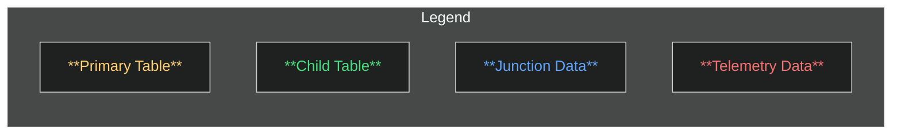

# StudyTrack - Entity Relationship Diagram

## Legend

---

## Full Entity Relationship Diagram

```mermaid
%%{init: {'theme': 'dark', 'themeVariables': { 'primaryColor': '#1a1a2e', 'primaryTextColor': '#f5f5f5', 'primaryBorderColor': '#FFCF70', 'lineColor': '#FFCF70', 'secondaryColor': '#16213e', 'tertiaryColor': '#0f3460', 'fontSize': '14px', 'background': '#0A0A0A'}}}%%
erDiagram
  User {
    uuid id PK
    string email UK
    string name
    string password "NULL for OAuth"
    string avatar
    enum role "STUDENT, ADMIN, MENTOR..."
    datetime emailVerified
    enum provider "LOCAL, GOOGLE, GITHUB..."
    string providerId
    string refreshToken
    json settings
    datetime createdAt
    datetime updatedAt
  }

  Profile {
    uuid id PK
    uuid userId FK "1:1"
    string bio
    string targetRole
    string currentLevel
    int weeklyHours
    string careerGoals
    json skills
    string timezone
  }

  LearningStreak {
    uuid id PK
    uuid userId FK "1:1"
    int currentStreak
    int longestStreak
    date lastActiveDate
  }

  Session {
    uuid id PK
    uuid userId FK
    string token UK
    string device
    string ip
    datetime lastActive
    datetime expiresAt
  }

  LoginHistory {
    uuid id PK
    uuid userId FK
    string device
    string ip
    string browser
    string os
    string location
    datetime createdAt
  }

  ActivityLog {
    uuid id PK
    uuid userId FK
    string action
    string entity
    uuid entityId
    json metadata
    datetime createdAt
  }

  StudySession {
    uuid id PK
    uuid userId FK
    string topic
    int duration "seconds"
    enum type "GENERAL, CODING, READING..."
    string notes
    datetime createdAt
  }

  Task {
    uuid id PK
    uuid userId FK
    string title
    string description
    enum priority "LOW, MEDIUM, HIGH, CRITICAL"
    enum status "TODO, IN_PROGRESS, DONE"
    datetime dueDate
    string category
    json checklist
    datetime createdAt
    datetime updatedAt
  }

  Note {
    uuid id PK
    uuid userId FK
    string title
    string content
    string[] tags
    string folderId
    boolean isPinned
    datetime createdAt
    datetime updatedAt
  }

  Collection {
    uuid id PK
    uuid userId FK
    string name
    string description
    string color
    string icon
    datetime createdAt
    datetime updatedAt
  }

  Resource {
    uuid id PK
    uuid userId FK
    string title
    enum type "PDF, VIDEO, LINK, CODE..."
    string url
    string fileKey
    string[] tags
    uuid collectionId FK "NULLable"
    boolean isFavorite
    datetime createdAt
    datetime updatedAt
  }

  Notification {
    uuid id PK
    uuid userId FK
    string title
    string body
    enum type "REMINDER, ACHIEVEMENT..."
    boolean isRead
    string actionUrl
    datetime createdAt
  }

  BrowserTelemetry {
    uuid id PK
    uuid userId FK
    string url
    string title
    string domain
    int duration "seconds"
    string category "Documentation, Programming..."
    datetime timestamp
  }

  DesktopTelemetry {
    uuid id PK
    uuid userId FK
    string activeApp
    string windowTitle
    string processName
    int duration "seconds"
    boolean isIdle
    string category "IDE, Terminal, Browser..."
    datetime timestamp
  }

  User ||--o| Profile : "has"
  User ||--o| LearningStreak : "has"
  User ||--o{ Session : "has"
  User ||--o{ LoginHistory : "has"
  User ||--o{ ActivityLog : "has"
  User ||--o{ StudySession : "logs"
  User ||--o{ Task : "creates"
  User ||--o{ Note : "writes"
  User ||--o{ Resource : "owns"
  User ||--o{ Collection : "organizes"
  User ||--o{ Notification : "receives"
  User ||--o{ BrowserTelemetry : "browses"
  User ||--o{ DesktopTelemetry : "uses"
  Collection ||--o{ Resource : "groups"
```

---

## Relationship Summary

```mermaid
%%{init: {'theme': 'dark', 'themeVariables': { 'primaryColor': '#0a0a0a', 'primaryTextColor': '#f5f5f5', 'lineColor': '#FFCF70', 'background': '#0A0A0A'}}}%%
flowchart TB
  subgraph Core["<b><font color=#FFCF70>CORE ENTITIES</font></b>"]
    U[("👤 <b>User</b>")]
    P[("📋 <b>Profile</b>")]
    LS[("🔥 <b>LearningStreak</b>")]
  end

  subgraph Auth["<b><font color=#60A5FA>AUTH & AUDIT</font></b>"]
    S[("🔑 <b>Session</b>")]
    LH[("📜 <b>LoginHistory</b>")]
    AL[("📝 <b>ActivityLog</b>")]
  end

  subgraph Learning["<b><font color=#4ADE80>LEARNING DATA</font></b>"]
    SS[("📚 <b>StudySession</b>")]
    T[("✅ <b>Task</b>")]
    N[("📓 <b>Note</b>")]
  end

  subgraph Resources["<b><font color=#FBBF24>RESOURCES</font></b>"]
    R[("📄 <b>Resource</b>")]
    C[("📁 <b>Collection</b>")]
  end

  subgraph Alerts["<b><font color=#F87171>ALERTS</font></b>"]
    NOTIF[("🔔 <b>Notification</b>")]
  end

  subgraph Telemetry["<b><font color=#A78BFA>TELEMETRY</font></b>"]
    BT[("🌐 <b>BrowserTelemetry</b>")]
    DT[("🖥️ <b>DesktopTelemetry</b>")]
  end

  U -->|1:1| P
  U -->|1:1| LS
  U -->|1:M| S
  U -->|1:M| LH
  U -->|1:M| AL
  U -->|1:M| SS
  U -->|1:M| T
  U -->|1:M| N
  U -->|1:M| R
  U -->|1:M| C
  U -->|1:M| NOTIF
  U -->|1:M| BT
  U -->|1:M| DT
  C -->|1:M| R

  style U fill:#1a1a2e,stroke:#FFCF70,stroke-width:3px,color:#fff
  style P fill:#16213e,stroke:#4ADE80,stroke-width:2px,color:#fff
  style LS fill:#16213e,stroke:#4ADE80,stroke-width:2px,color:#fff
  style S fill:#1a1a2e,stroke:#60A5FA,stroke-width:2px,color:#fff
  style LH fill:#1a1a2e,stroke:#60A5FA,stroke-width:2px,color:#fff
  style AL fill:#1a1a2e,stroke:#60A5FA,stroke-width:2px,color:#fff
  style SS fill:#1a1a2e,stroke:#4ADE80,stroke-width:2px,color:#fff
  style T fill:#1a1a2e,stroke:#4ADE80,stroke-width:2px,color:#fff
  style N fill:#1a1a2e,stroke:#4ADE80,stroke-width:2px,color:#fff
  style R fill:#1a1a2e,stroke:#FBBF24,stroke-width:2px,color:#fff
  style C fill:#1a1a2e,stroke:#FBBF24,stroke-width:2px,color:#fff
  style NOTIF fill:#1a1a2e,stroke:#F87171,stroke-width:2px,color:#fff
  style BT fill:#1a1a2e,stroke:#A78BFA,stroke-width:2px,color:#fff
  style DT fill:#1a1a2e,stroke:#A78BFA,stroke-width:2px,color:#fff
```

---

## Cardinality Reference

| Relationship | Type | Description |
|-------------|------|-------------|
| User <-> Profile | 1:1 | Every user has exactly one extended profile |
| User <-> LearningStreak | 1:1 | Every user has exactly one streak tracker |
| User <-> Session | 1:M | One user can have many active login sessions |
| User <-> LoginHistory | 1:M | One user can have many login history records |
| User <-> ActivityLog | 1:M | One user can have many activity log entries |
| User <-> StudySession | 1:M | One user can log many study sessions |
| User <-> Task | 1:M | One user can create many tasks |
| User <-> Note | 1:M | One user can write many notes |
| User <-> Resource | 1:M | One user can own many resources |
| User <-> Collection | 1:M | One user can organize many collections |
| User <-> Notification | 1:M | One user can receive many notifications |
| User <-> BrowserTelemetry | 1:M | One user generates many browser telemetry events |
| User <-> DesktopTelemetry | 1:M | One user generates many desktop telemetry events |
| Collection <-> Resource | 1:M | One collection can group many resources (SET NULL on delete) |

---

## Index Strategy

| Table | Indexes | Purpose |
|-------|---------|---------|
| User | email, role, provider | Fast login lookup, role filtering, OAuth provider search |
| Session | userId, token | Session lookup by user and by token |
| LoginHistory | userId, createdAt | User login history and audit queries |
| StudySession | userId, createdAt, topic, type | Dashboard queries, topic analysis, type filtering |
| Task | userId, status, priority, dueDate, category | Task filtering, sorting, and deadline queries |
| Note | userId, tags (GIN), isPinned, folderId | Full-text tag search, pinned notes, folder grouping |
| Resource | userId, type, collectionId, tags (GIN), isFavorite | Resource discovery, collection browsing, favorites |
| Notification | userId, isRead, type, createdAt | Unread notification count, type filtering, chronological order |
| ActivityLog | userId, action, entity, createdAt | Audit trail queries |
| BrowserTelemetry | userId, domain, category, timestamp | Analytics aggregation, domain/ category grouping |
| DesktopTelemetry | userId, activeApp, category, timestamp | Analytics aggregation, app/ category grouping |
